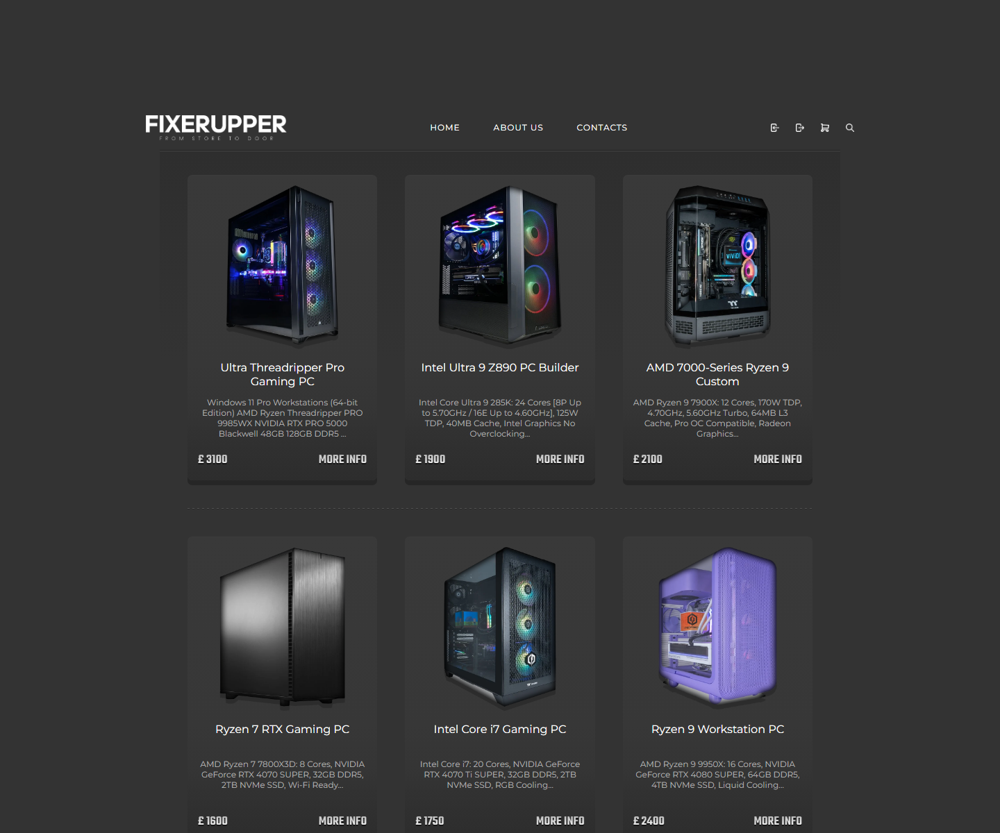
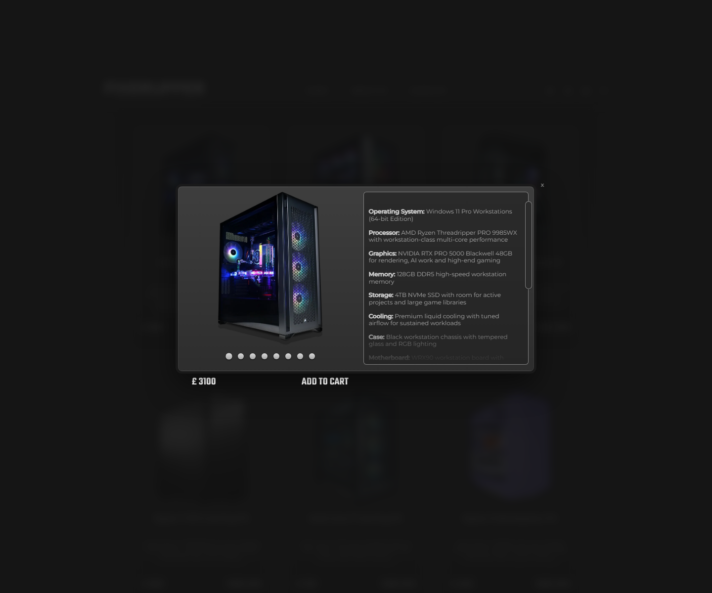
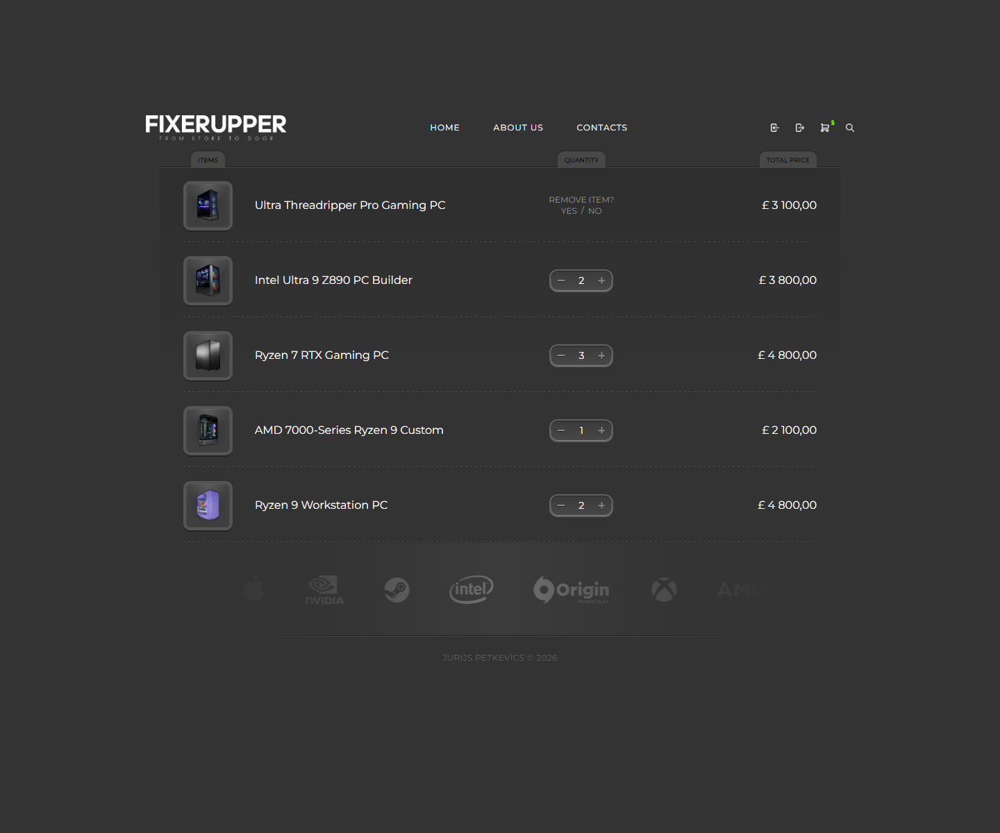
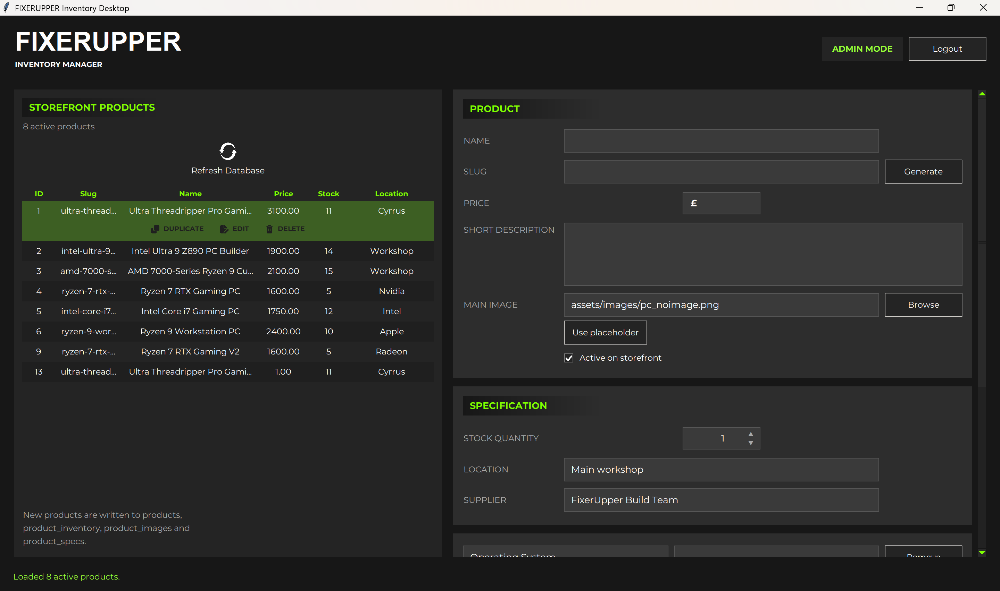
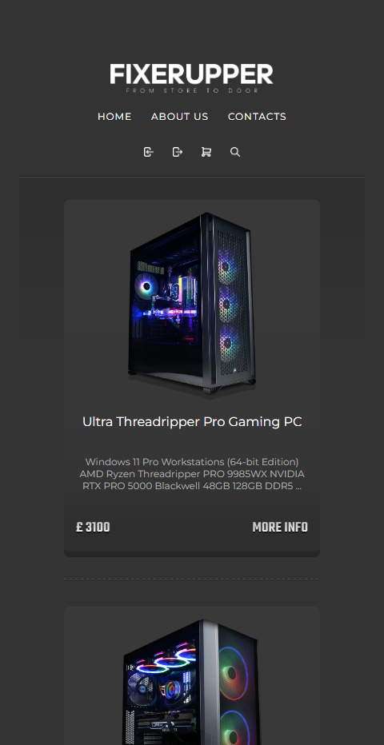
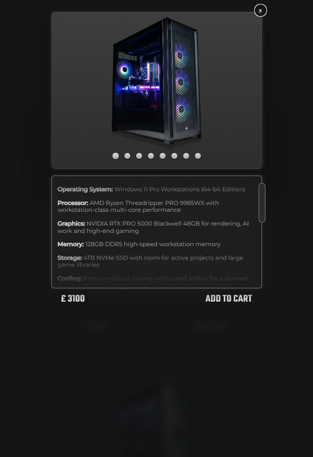
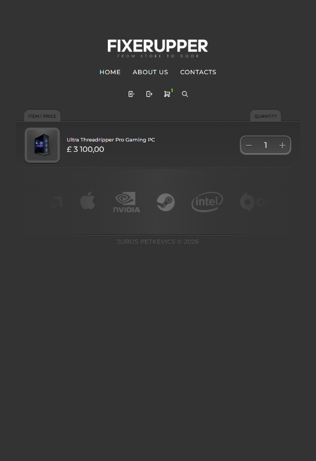

# FixerUpper

FixerUpper is a responsive gaming PC storefront built with PHP, MySQL, CSS and
JavaScript. The site displays configurable gaming/workstation PCs, opens product
details in an animated modal, limits cart quantities by available stock, and
includes an inventory workflow for managing product availability.

The project also includes a Python desktop administration tool for adding new
storefront products. The desktop app writes directly to the same XAMPP/MySQL
database used by the PHP site, so new products can appear on the storefront
without editing SQL manually.

## Screenshots

### Desktop Storefront



### Product Details Modal



### Shopping Cart



### Desktop Admin Tool



### Mobile Views

| Homepage | Product Modal | Cart |
| --- | --- | --- |
|  |  |  |

## Main Features

- Responsive product grid for desktop, tablet and mobile layouts.
- Dynamic product loading from MySQL instead of hard-coded product cards.
- Product details modal with gallery dots, image preloading, swipe support and
  scroll locking.
- Session-backed shopping cart with live item counts.
- Server-authoritative cart pricing and stock validation.
- Quantity controls with direct numeric input, plus/minus buttons and remove
  confirmation.
- Inventory page for stock quantity, product location and supplier notes.
- Inventory save flow with edited-field highlighting and system messages.
- Cart quantity limits based on available inventory.
- Animated advertising logo strip.
- Homepage showcase for the Python desktop admin tool.
- Python desktop admin app with login, product creation, editing, duplication,
  soft-delete actions, inventory fields, image registration and modal specs.
- Windows launcher for opening the desktop app from the `tools` directory.

## Technology Stack

- PHP with mysqli for server-rendered pages and JSON cart endpoints.
- MySQL/InnoDB with utf8mb4 tables and foreign-key relationships.
- JavaScript for modal behavior, cart updates, inventory controls and UI state.
- CSS for the dark FixerUpper visual system, responsive layout and animations.
- Python 3 with Tkinter for the desktop administration app.
- XAMPP for local Apache/MySQL development on Windows.

## Database Overview

The database schema is stored in `database/fixerupper.sql`.

- `products` stores the main storefront records: slug, name, short description,
  price, main image and active flag.
- `product_inventory` stores saleable stock, workshop location and supplier
  notes for each product.
- `product_images` stores ordered modal/gallery images.
- `product_specs` stores labelled modal details such as Processor, Graphics,
  Memory and Storage.
- `users` stores login credentials and the `user`/`admin` role used by the
  desktop app.
- `orders` and `order_items` are prepared for future checkout work.

The seeded database creates six active PC products with inventory, one image per
product and modal specification rows. The SQL seed is idempotent, so it can be
re-imported during development without duplicating products.

## Local Setup

1. Start Apache and MySQL in XAMPP.
2. Import `database/fixerupper.sql` into MySQL.
3. Open `http://localhost/fixerupper/index.php`.
4. Open `http://localhost/fixerupper/inventory.php` to manage existing product
   stock.

The PHP inventory helper also creates `product_inventory` automatically if the
table is missing.

## Python Desktop Product Creator

The desktop app is located at:

```text
tools/fixerupper_inventory_desktop.py
```

Run it from the project root:

```powershell
cd C:\xampp\htdocs\fixerupper
python tools\fixerupper_inventory_desktop.py
```

Or launch it with the Windows launcher:

```powershell
.\tools\launch_inventory_desktop.bat
```

Use the database health check before launching the UI:

```powershell
python tools\fixerupper_inventory_desktop.py --check-db
```

The same check can be run through the launcher:

```powershell
.\tools\launch_inventory_desktop.bat --check-db
```

The desktop app requires an admin login. The seeded local admin account is:

```text
username: admin
password: admin
email: quazarmovies@gmail.com
```

The tool creates a full storefront product in one transaction:

1. Inserts the product into `products`.
2. Inserts initial stock, location and supplier into `product_inventory`.
3. Registers the main image in `product_images`.
4. Adds optional modal rows to `product_specs`.

If an image is selected from outside the project, the tool copies it into
`assets/images` and stores the site-relative path in MySQL. Existing assets are
not overwritten; the app appends a numeric suffix when a filename already exists.

Double-click a product row to open inline actions. The expanded row shows
`DUPLICATE`, `EDIT` and `DELETE` buttons with matching icons; clicking another
product row closes the action panel and selects that product.

### Desktop App Configuration

The app uses the same local database settings as `config.php` by default:

- MySQL executable: `C:\xampp\mysql\bin\mysql.exe`
- Database: `fixerupper`
- User: `root`
- Password: empty

Optional environment variables:

- `FIXERUPPER_MYSQL_EXE`
- `FIXERUPPER_DB_NAME`
- `FIXERUPPER_DB_USER`
- `FIXERUPPER_DB_PASSWORD`

## Inventory Notes

- Out of stock is shown when inventory reaches 0.
- Low stock is calculated as 1 to 3 items.
- Medium stock is calculated as 4 to 9 items.
- `product_inventory` does not currently use a `reorder_level` column.
- Cart endpoints always re-check stock on the server before accepting quantity
  changes.
- Editing location or supplier text highlights the changed field until the next
  successful save.

## Project Structure

```text
fixerupper/
|-- assets/
|   |-- css/style.css
|   |-- images/
|   |   |-- fixerupper_desktop_app.png
|   |   |-- homepage-screenshot.png
|   |   |-- more-info-screenshot.png
|   |   `-- shopping-cart-screenshot.png
|   `-- js/
|-- database/fixerupper.sql
|-- docs/
|   |-- screenshots/
|   |-- fixerupper-documentation.html
|   |-- Petkevics_Jurijs_2409-125534_2425_COMP_PFD200_Pratical-Sem2.docx
|   `-- Petkevics_Jurijs_2409-125534_2425_COMP_PFD200_Pratical-Sem2.pdf
|-- tools/
|   |-- fixerupper_inventory_desktop.py
|   `-- launch_inventory_desktop.bat
|-- index.php
|-- cart.php
|-- inventory.php
|-- add_to_cart.php
`-- update_cart.php
```

## Troubleshooting

- If the site cannot connect to the database, make sure MySQL is running in
  XAMPP and the `fixerupper` database has been imported.
- If the desktop app reports that `mysql.exe` was not found, set
  `FIXERUPPER_MYSQL_EXE` to the correct XAMPP MySQL client path.
- If a newly-added product does not appear on the storefront, confirm that
  `is_active` is enabled in the desktop app and refresh `index.php`.
- If cart quantity updates fail, check the product's `stock_quantity` in
  `product_inventory`.
